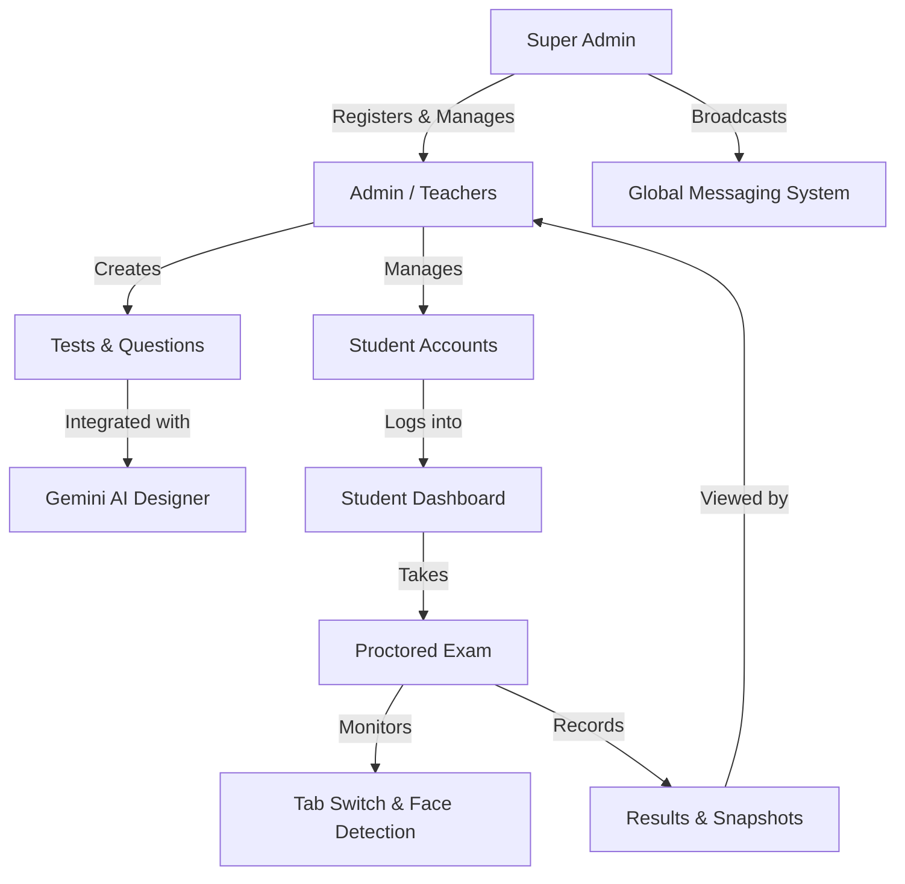

# 🎓 Exammiee - Advanced Online Examination Platform

Exammiee is a high-performance, production-ready online examination platform designed for institutions and individual educators. It features a modern, glassmorphism-inspired UI, advanced AI-driven test creation, and robust proctoring security.

---


### 🔄 How it Works


---

## 🔑 Roles & Permissions

| Role | Power & Capabilities |
| :--- | :--- |
| **Super Admin** | • **Global Control**: Manage all Teachers/Admins.<br>• **Analytics**: View system-wide usage statistics.<br>• **Broadcasting**: Send messages to the entire platform (Admins & Students).<br>• **Migration**: Handle database and security updates. |
| **Admin (Teacher)** | • **Student Management**: Register, edit, and delete students.<br>• **Exam Design**: Create tests manually or using **Gemini AI**.<br>• **Assignment**: Assign specific tests to specific students.<br>• **Monitoring**: View results and proctoring snapshots of their own students. |
| **Student** | • **Exam Execution**: Take assigned tests in a secure environment.<br>• **Messaging**: Receive updates from their Teacher or System.<br>• **Performance**: View their own scores (if released by teacher). |

## 🚀 Key Features

### 🔐 Multi-Role Access Control
- **Super Admin**: Global control over all administrators, overall system analytics, and platform-wide messaging.
- **Admin (Teacher)**: Manage students, design tests (manual or AI-assisted), assign exams, and review detailed proctoring results.
- **Student**: Personalized dashboard for taking exams, viewing performance results, and receiving teacher updates.

### 🤖 AI-Powered Test Design
- Integrated **Gemini AI** designer to help teachers generate complex questions and options in seconds using custom prompt templates.

### 🛡️ Advanced Proctoring & Security
- **Tab-Switch Detection**: Monitors when students leave the exam tab with a strike penalty system.
- **Full-Screen Enforcement**: Requires students to remain in full-screen mode to continue the test.
- **AI Camera Snapshots**: Automatically captures student photos during the exam to ensure identity and integrity.
- **Marks Visibility Toggle**: Teachers can choose when to release marks to students.

### 💬 Unified Messaging Center
- Role-based floating message panel.
- **Super Admin**: Can broadcast to all teachers and students.
- **Teacher**: Receives instructions from Super Admin and manages student communications.

---

## 🛠️ Technology Stack

- **Frontend**: HTML5, Vanilla JavaScript, CSS3 (Tailwind CSS for UI architecture).
- **Backend**: Node.js, Express.js.
- **Database**: MySQL (using `mysql2` pool).
- **Icons**: FontAwesome 6.0.
- **Fonts**: Outfit (Google Fonts).

---

## ⚙️ Setup & Installation

### 1. Prerequisites
- [Node.js](https://nodejs.org/) (v14 or higher)
- [MySQL Server](https://www.mysql.com/) installed and running.

### 2. Database Configuration
1. Create a new database named `exammiee`:
   ```sql
   CREATE DATABASE exammiee;
   ```
2. Update the `.env` file in the root directory:
   ```env
   DB_HOST=localhost
   DB_USER=root
   DB_PASSWORD=your_password
   DB_NAME=exammiee
   ```

### 3. Installation
1. Clone the repository or extract the files.
2. Install dependencies:
   ```powershell
   npm install
   ```

### 4. Run the Project
Start the server:
```powershell
node server.js
```
The application will be available at `http://localhost:3000`.

---

## 👤 Default Credentials
| Role | ID | Password |
| :--- | :--- | :--- |
| **Super Admin** | `superadmin` | `superpass` |
| **Admin** | `admin` | `adminpass` |

---

## 🎨 UI/UX Design
Exammiee uses a **Glassmorphism Design System** featuring:
- Translucent card backgrounds with backdrop blurs.
- Responsive grid layouts for all dashboards.
- Dynamic theme switching (Light / Dark mode).
- Smooth CSS animations for a premium user experience.
